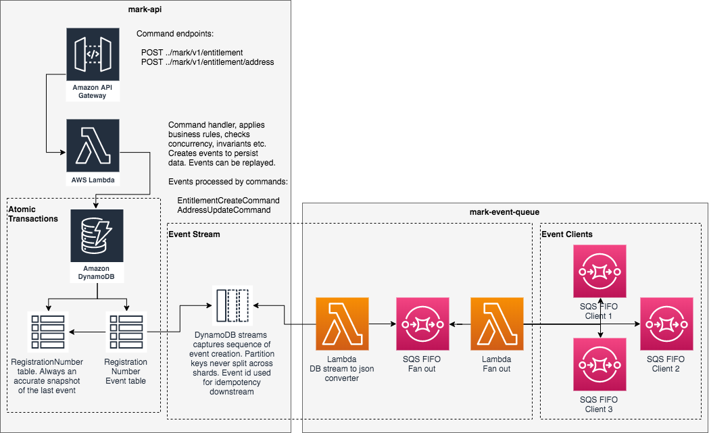

# mark-event-queue



This applications depicted above, mark-api and mark-event-queue, are intended as a strawman to demonstrate the benefits of a light-weight, purely serverless event sourcing system. Event sourcing stores every state change to the application as an event object. These event objects are stored in the sequence they were applied for the lifetime of the application.

This mark-event-queue application has a companion application, [mark-api](https://github.com/simon-cutts/mark-api). The mark-api app is a microservice managing marks; mark-event-queue is an application consuming the events produced from mark-api.

Serverless was chosen to simplify the infrastructure with minimal dev ops; but, just as importantly, to use native cloud services rather than rely non-trivial specialist event sourced application frameworks. 

### Event Stream

Events traverse the event stream to notify downstream clients. The event stream is a combination of mark-api and mark-event-queue; its transactional and comprises:

1. From mark-api, a DynamoDB stream from the `RegistrationNumberEvent` table, emits transactional, reliable, time ordered sequence of events. Events remain in `RegistrationNumberEvent` for the lifetime of the mark-api application 
2. The ``Lambda DB stream to json converter`` lambda in the mark-event-queue app picks data off the DynamoDB stream and reassembles it into a JSON representation of the event. This event is then written to the  `SQS FIFO Fan out` queue within mark-event-queue.
3. The `SQS FIFO Fanout` queue within mark-event-queue maintains the same time ordered sequence of events that can be fanned out to multiple interested clients
4. The `Lambda Fan out` lambda within mark-event-queue distributes the message events from `SQS FIFO Fanout` queue to all interested `SQS FIFO Client` destinations

## Installation
The application can be deployed in an AWS account using the [Serverless Application Model (SAM)](https://github.com/awslabs/serverless-application-model). 

To build and install the mark-event-queue application you will need [AWS CLI](https://aws.amazon.com/cli/), [SAM](https://github.com/awslabs/serverless-application-model) and [Maven](https://maven.apache.org/) installed on your computer.

Once they have been installed, from the shell, navigate to the root folder of the app and use maven to build a deployable jar. 
```
$ mvn clean package
```

This command should generate a `mark-event-queue.jar` in the `target` folder. Now that we have generated the jar file, we can use SAM to package the sam for deployment. 

You will need a deployment S3 bucket to store the artifacts for deployment. Once you have created the deployment S3 bucket, run the following command from the app root folder:

```
$ sam package --output-template-file packaged.yml --s3-bucket <YOUR DEPLOYMENT S3 BUCKET NAME>

Uploading to xxxxxxxxxxxxxxxxxxxxxxxxxx  6464692 / 6464692.0  (100.00%)
Successfully packaged artifacts and wrote output template to file output-template.yaml.
Execute the following command to deploy the packaged template
aws cloudformation deploy --template-file /your/path/output-template.yml --stack-name <YOUR STACK NAME>
```

You can now use the cli to deploy the application. Choose a stack name and run the `sam deploy` command.
 
```
$ sam deploy --template-file ./packaged.yml --stack-name <YOUR STACK NAME> --capabilities CAPABILITY_IAM
```

Once the application is deployed, you can describe the stack thus:

```
$ aws cloudformation describe-stacks --stack-name <YOUR STACK NAME>
{
    "Stacks": [
        {
            "StackId": "arn:aws:cloudformation:eu-west-2:022099488461:stack/mark-event-queue/a57f9bb0-1a79-11ea-8ce6-02bbe2e31b38",
            "StackName": "mark-event-queue",
            "ChangeSetId": "arn:aws:cloudformation:eu-west-2:xxxxxxxxxxx:changeSet/awscli-cloudformation-package-deploy-xxxxxxx/6b45482c-9d30-42af-9504-880649b8cc94",
            "Description": "AWS Mark - mark-event-queue",
            "CreationTime": "2019-12-09T11:47:15.842Z",
            "LastUpdatedTime": "2019-12-10T07:15:30.262Z",
            "RollbackConfiguration": {},
            "StackStatus": "UPDATE_COMPLETE",
            "DisableRollback": false,
            "NotificationARNs": [],
            "Capabilities": [
                "CAPABILITY_IAM"
            ],
            "Outputs": [
                {
                    "OutputKey": "ClientQueueARN",
                    "OutputValue": "arn:aws:sqs:eu-west-2:xxxxxxxx:MarkFanOutClientQueue.fifo",
                    "Description": "ARN of client FanOutQueue SQS"
                },
                {
                    "OutputKey": "QueueName",
                    "OutputValue": "MarkFanOutQueue.fifo",
                    "Description": "Name of FanOutQueue SQS"
                },
                {
                    "OutputKey": "QueueARN",
                    "OutputValue": "arn:aws:sqs:eu-west-2:xxxxxxx:MarkFanOutQueue.fifo",
                    "Description": "ARN of FanOutQueue SQS"
                },
                {
                    "OutputKey": "ClientQueueName",
                    "OutputValue": "MarkFanOutClientQueue.fifo",
                    "Description": "Name of client FanOutQueue SQS"
                }
            ],
            "Tags": [],
            "EnableTerminationProtection": false,
            "DriftInformation": {
                "StackDriftStatus": "NOT_CHECKED"
            }
        }
    ]
}
```

If any errors were encountered, examine the stack events to diagnose the issue

```
$ aws cloudformation describe-stack-events --stack-name <YOUR STACK NAME>
```

At any time, you may delete the stack

```
$ aws cloudformation delete-stack --stack-name <YOUR STACK NAME>
```
